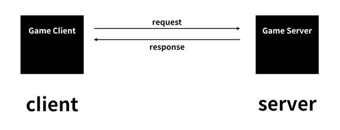

# Web_Practice   
Demo Website : https://draidev.github.io/Web_Practice/1.html
<br>

### 목차
[1. HTML이란?](#1-html이란)      
[2. 서버와 클라이언트](#2-서버와-클라이언트)   
[3. CSS](#3-css란)   
- [CSS box model](#css-box-model)    
[HTTP](#3-http)   

<br><br>

# 생활코딩 WEB1 & INTERNET

## 1. [HTML](https://developer.mozilla.org/ko/docs/Learn/HTML/Introduction_to_HTML/Getting_started)이란?
**HTML (Hypertext Markup Language,하이퍼텍스트 마크업 언어)** 는 프로그래밍 언어는 아니고, 우리가 보는 웹페이지가 어떻게 구조화되어 있는지 브라우저로 하여금 알 수 있도록 하는 마크업 언어입니다. 이는 개발자로 하여금 복잡하게도 간단하게도 프로그래밍 할 수 있습니다. HTML은 [elements](https://developer.mozilla.org/ko/docs/Glossary/Element)로 구성되어 있으며, 이들은 적절한 방법으로 나타내고 실행하기 위해 각 컨텐츠의 여러 부분들을 감싸고 마크업 합니다. [tags](https://developer.mozilla.org/ko/docs/Glossary/Tag) 는 웹 상의 다른 페이지로 이동하게 하는 하이퍼링크 내용들을 생성하거나, 단어를 강조하는 등의 역할을 합니다.

* HTML 태그 사용빈도 확인 사이트 -> [Advanced WEB RANKING](https://www.advancedwebranking.com/seo/html-study/)

## 2. [서버와 클라이언트](http://wiki.hash.kr/index.php/%EC%84%9C%EB%B2%84-%ED%81%B4%EB%9D%BC%EC%9D%B4%EC%96%B8%ED%8A%B8) 
**서버(server)** 란 통신망 상에서 다른 컴퓨터에 대하여 회선, 디스크 장치 등에 대한 접속을 제어하는 관리 소프트웨어 또는 컴퓨터를 말한다. 
서버는 그 역할에 따라 웹(Web) 서버, 와스(WAS) 서버, 디비(DB) 서버 등이 있다.

**클라이언트(client)** 란 네트워크를 이용하여 서버 시스템에 연결된 PC나 스마트폰 등 사용자 측을 말한다. 클라이언트는 서버에서 받아온 데이터를 단말기 화면에 표시하고 사용자의 요청을 서버에 전달하기 위해 웹브라우저를 사용한다.   
<p align="center"></p>

### **장단점**   
**장점**   
**서버-클라이언트 구조**는 매우 효율적인 네트워크 구조이다. 다수의 사용자들이 공동으로 열람·복사·수정·관리하는 데이터를 여러 곳에 분산시키지 않고 단일한 중앙 서버에 저장하여 관리함으로써 데이터의 유일성과 통일성을 보장할 수 있다. 탈중앙 분산 저장 방식에 필요한 합의 알고리즘이 필요 없다. 중앙 서버만 관리하면 되므로 분산 저장 방식에 비해 네트워크 구성 및 유지관리 비용이 적게 든다.

**단점**   
서버-클라이언트 구조는 해킹 공격과 디도스 및 랜섬웨어 공격 등에 취약하다. 모든 중요 데이터가 중앙 서버에 집중되어 있기 때문에 해커가 중앙 서버에 침투하여 데이터를 위변조할 경우 모든 클라이언트들에게 잘못된 정보가 전달된다. 이를 방어하기 위해 방화벽, 웹 방화벽, 침입탐지시스템(IDS), 침입방지시스템(IPS) 등 다양한 보안 제품을 설치하고, 서버에 저장된 데이터를 복사하여 별도의 저장장치에 백업을 해야 하기 때문에 추가적인 비용이 들어간다.

## 3. [CSS](https://developer.mozilla.org/ko/docs/Learn/Getting_started_with_the_web/CSS_basics)란?   
**종속형 시트 또는 캐스케이딩 스타일 시트(Cascading Style Sheets, CSS)** 는 마크업 언어가 실제 표시되는 방법을 기술하는 스타일 언어(style sheet language)로, HTML과 XHTML에 주로 쓰이며, [XML](http://www.tcpschool.com/xml/xml_intro_basic)에서도 사용할 수 있다. W3C의 표준이며, 레이아웃과 스타일을 정의할 때의 자유도가 높다.

### CSS의 ruleset 해부          
<p align="center"></p>    

**선택자(selector)**      
 rule set의 맨 앞에 있는 HTML 요소 이름. 이것은 꾸밀 요소(들)을 선택합니다 (이 예에서는 p 요소). 다른 요소를 꾸미기 위해서는 선택자만 바꿔주세요.   

**선언(Decalaration)**   
color: red와 같은 단일 규칙; 여러분이 꾸미기 원하는 요소의 속성을 명시합니다.

**속성(Property)**    
주어진 HTML 요소를 꾸밀 수 있는 방법입니다. (이 예에서, color는 p 요소의 속성입니다.) CSS에서, rule 내에서 영향을 줄 속성을 선택합니다.

**속성 값(Property value)**     
속성의 오른쪽에, 콜론 뒤에, 주어진 속성을 위한 많은 가능한 결과중 하나를 선택하기 위해 속성 값을 갖습니다 (color 의 값에는 red 외에 많은 것이 있습니다).
### 지켜야할 문법
* 각각의 rule set (셀렉터로 구분) 은 반드시 ({}) 로 감싸져야 합니다.
* 각각의 선언 안에, 각 속성을 해당 값과 구분하기 위해 콜론 (:)을 사용해야만 합니다.
* 각각의 rule set 안에, 각 선언을 그 다음 선언으로부터 구분하기 위해 세미콜론 (;)을 사용해야만 합니다.


### [CSS box model](https://developer.mozilla.org/ko/docs/Learn/CSS/Building_blocks/The_box_model) 

<p align="center"><image src="./images/cssbox.jpg" width="75%"> </p>

```css
    /*
    block element
    화면 전체공간을 차지합니다.
    */
    h1{
        border-width: 5px;
        border-color: red;
        border-style: solid;
        /* display 속성으로 inline, block 값을 조절할 수 있습니다. */
        /* display: inline; */
    }

    /*
    inline element
    자신의 크기만큼 공간을 차지합니다.
    */
    a{
        border-width: 5px;
        border-color: red;
        border-style: solid;
        /* display: block; */
    }

```
### [padding, border, margin, width, height](https://developer.mozilla.org/ko/docs/Learn/CSS/Building_blocks/The_box_model#%EC%97%AC%EB%B0%B1%EA%B3%BC_%ED%8C%A8%EB%94%A9%EA%B3%BC_%ED%85%8C%EB%91%90%EB%A6%AC)
```css
    h1{
        padding:20px;
        border:10px solid red;
        margin:20px;
        width:100px;
        height:20px;
    }
```
<p align="center"><image src="./images/CSSbox1.jpg" width="50%"> </p>

## [HTTP](https://developer.mozilla.org/ko/docs/Web/HTTP/Overview)
**HTTP** 는 **HTML 문서와 같은 리소스들을 가져올 수 있도록 해주는** [프로토콜](https://developer.mozilla.org/ko/docs/Glossary/Protocol)입니다. HTTP는 웹에서 이루어지는 모든 데이터 교환의 기초이며, 클라이언트-서버 프로토콜이기도 합니다. 클라이언트-서버 프로토콜이란 (보통 웹브라우저인) 수신자 측에 의해 요청이 초기화되는 프로토콜을 의미합니다. 하나의 완전한 문서는 텍스트, 레이아웃 설명, 이미지, 비디오, 스크립트 등 불러온(fetched) 하위 문서들로 재구성됩니다.
<p align="center"></p>


출처 : [MDN](https://developer.mozilla.org/ko/), [해시넷](http://wiki.hash.kr)

